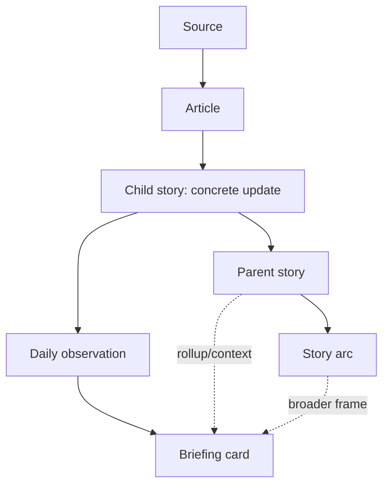

# ADR 0015: IMPORTANT - Parent/child story arcs

**Date:** 2026-05-16

## Status

Accepted with staged implementation.

This ADR records the target parent/child story design. The first PR only ships the lightweight `story_developments` step on top of the existing `stories` table. The full `story_arcs`, `stories.arc_id`, and `stories.parent_story_id` schema is a target design, not part of the first PR unless that schema is added later.

2026-05-20 follow-up: ADR 0016 promotes the target `story_arcs`, `stories.arc_id`, and `stories.parent_story_id` shape into the current implementation while keeping the lightweight `story_developments` rows for daily observability.

## Context

The tracker originally stored story memory as a flat set of `stories` rows with daily observations. That works for narrow event continuity, but reviewed briefings showed a recurring structural problem: some developments are not the same concrete event, yet they clearly belong inside the same larger news arc.

ADR 0008 made the tracker stricter after a false merge between adjacent Gaza-related coverage. It left one open question:

```text
Should a story with no strong match become NEW, or should it be attached to a broader parent arc once parent/child story arcs exist?
```

That question is now load-bearing. The system needs to keep same-story identity strict while preserving broader narrative context.

Recent briefing pressure:

- `briefings/briefing_20260513_2222.md`: `Iran war escalation and fallout` mixes Netanyahu's UAE visit, Hormuz risk, U.S. war-powers votes, oil/fuel effects, and intelligence disagreement. These are related children under a war arc, not always one event.
- `briefings/briefing_20260513_2222.md` and `briefings/briefing_20260512_2207.md`: `Dutch asylum policy rift` carries both national reception-policy pressure and the Loosdrecht public-order child story.
- `briefings/briefing_20260513_2222.md`, `briefings/briefing_20260512_2207.md`, and `briefings/briefing_20260511_2134.md`: Ukraine coverage moves from ceasefire ambiguity to resumed attacks to a large drone barrage. The war arc is continuous, but each concrete development may deserve child memory.
- `briefings/briefing_20260512_2207.md` and `briefings/briefing_20260511_2134.md`: October 7 legal accountability appears as related but separable threads: proposed trials, tribunal powers, and sexual-violence investigation findings.
- `briefings/briefing_20260512_2207.md` and `briefings/briefing_20260511_2134.md`: U.S.-China coverage evolves from summit preparation to agenda pressure around Taiwan, rare earths, trade, and Iran. That is an ongoing diplomacy arc with changing children.
- `briefings/briefing_20260516_2256.md`: `Iran conflict` and `Iran war escalation and fallout` appear as separate briefing cards, showing that the current lightweight parent labels still cannot express a shared higher-level Iran arc.
- `briefings/briefing_20260516_2256.md`: `Lebanon ceasefire`, `Russia-Ukraine war`, `Israel-Gaza war and ceasefire`, `Taiwan Tensions`, and `US-China trade tensions` show `NEW DEVELOPMENT` output under parent labels. This validates the first lightweight step, while also showing that some generated child labels remain too broad or redundant.

The flat model forces a bad choice:

- merge adjacent updates and risk corrupting event memory
- mark everything `NEW` and lose higher-level continuity
- rely on briefing prose to explain the relationship after the database has already flattened it

## Decision

Introduce explicit parent/child story structure while keeping event-level matching conservative.

Use three concepts as the target model:

- **Arc**: long-lived narrative context, such as `Iran war`, `Dutch asylum policy`, `Russia-Ukraine war`, or `U.S.-China trade tensions`.
- **Parent story**: a reportable thread inside an arc, such as `Iran war escalation and fallout` or `Dutch asylum policy rift`.
- **Child story**: the most specific evidence-bearing update, such as `Netanyahu UAE wartime visit`, `Loosdrecht asylum shelter unrest`, or `Russia large Ukraine drone barrage`.

The same concrete article should attach to the most specific child story available. Parent and arc context should be derived through relationships and rollups, not by merging unrelated child events into one flat story.



## First PR Scope

The first PR does not add the full target schema. It ships a conservative intermediate structure:

```text
stories -> story_developments -> articles
```

In this first step:

- `stories` continues to hold the canonical tracked story row.
- Broad existing `stories` rows may act as lightweight parent arcs for future runs.
- `story_developments` stores today's specific development labels under a parent `story_id`.
- Articles still link to the parent `story_id` for compatibility, while tracked article payloads also carry `development_id`, `development_label`, and `development_status`.
- Existing historical story rows are not backfilled or merged.
- Observability records developments saved, parent attachments, new parent arcs, and unmatched new stories.

The implemented additive table is:

```sql
story_developments (
    development_id      INTEGER PRIMARY KEY AUTOINCREMENT,
    story_id            INTEGER NOT NULL,
    observation_id      INTEGER,
    date                DATE NOT NULL,
    development_label   TEXT NOT NULL,
    development_status  TEXT NOT NULL,
    source_count        INTEGER,
    article_count       INTEGER,
    importance_avg      REAL,
    parent_relationship TEXT,
    parent_confidence   TEXT,
    created_at          TEXT DEFAULT CURRENT_TIMESTAMP,
    UNIQUE (story_id, date, development_label)
)
```

This first step is intentionally less expressive than the target design. It makes continuing arcs inspectable without forcing a destructive migration or claiming the full hierarchy is solved.

## Target Persistence Shape

A later PR can promote the lightweight structure into explicit arcs and parent links:

```sql
story_arcs (
    arc_id          INTEGER PRIMARY KEY AUTOINCREMENT,
    canonical_label TEXT NOT NULL,
    theme           TEXT,
    first_seen      DATE NOT NULL,
    last_seen       DATE NOT NULL
);

stories (
    story_id        INTEGER PRIMARY KEY AUTOINCREMENT,
    arc_id          INTEGER REFERENCES story_arcs(arc_id),
    parent_story_id INTEGER REFERENCES stories(story_id),
    canonical_label TEXT NOT NULL,
    theme           TEXT,
    first_seen      DATE NOT NULL,
    last_seen       DATE NOT NULL
);
```

Target constraints:

- A story has at most one `arc_id`.
- A story has at most one `parent_story_id`.
- A parent and child must be in the same arc when both have an arc.
- Articles link to the most specific story node, not directly to the arc.
- Arc-level and parent-level counts are rollups, not duplicate article rows.

## Matching Rules

Do not loosen the same-story match contract from ADR 0008.

Reusing an existing `story_id` still requires direct continuity:

- `same_event`
- `same_story_arc`
- `direct_follow_up`

Rejected verifier relationships such as `adjacent_topic` or `broader_context` must not be treated as proof that today's item is the same concrete story. With parent/child structure, they can instead become a new child development under the same parent or arc when the relationship is strong enough.

This separates two decisions:

1. **Identity match**: is this the same concrete story record?
2. **Parent or arc assignment**: if not the same story, does it belong under an existing parent or arc?

The first decision protects memory integrity. The second preserves narrative continuity.

In the first PR, rejected verifier matches can attach as `new_child` developments only when:

- the relationship is useful parent continuity, such as `adjacent_topic`, `broader_context`, or `direct_follow_up`
- confidence is medium or high
- continuity evidence is present
- the candidate or today label has parent-arc shape, such as war, conflict, crisis, migration, market, trade, sanctions, attacks, or violence

This does not claim the child is the same event as the parent. It only records that the child belongs inside the broader parent context.

## Briefing Behavior

Briefing selection should prefer child stories when the child has enough source support, importance, or movement. Parent stories can appear when the system needs to summarize several related children together.

The first PR can already render lightweight parent/development context:

```text
NEW DEVELOPMENT Iran conflict
Parent arc: Iran conflict | Today's development: Iran-backed militia attacks; Iran opposition threats
```

The target behavior should be able to say:

```text
Arc: Iran war
Parent: Iran war escalation and fallout
Children: Netanyahu UAE visit, Hormuz shipping risk, U.S. war-powers pressure
```

This avoids pretending those children are all the same event while still giving readers the larger frame.

## Consequences

Positive:

- Preserves event-level memory without losing narrative context.
- Resolves the ADR 0008 parent/child open question with a staged answer.
- Gives reviewers a cleaner explanation for why adjacent stories are not false `NEW` rows.
- Makes briefings less dependent on prose to repair a flat database model.
- Keeps the first PR additive and compatible with existing `data/stories.db`.

Negative:

- Adds another matching decision: parent or arc assignment.
- The first PR's `stories`-as-parent-arc approach is less clean than explicit `story_arcs`.
- Existing article rows still point at the parent story in the first PR, so child-level evidence ownership is not fully normalized yet.
- Parent rollups can double count sources if future code copies rows instead of deriving aggregation.
- Briefing selection needs clearer rules for when to show a child, a parent, or both.

## What This Does Not Do

- It does not allow broad topic similarity to reuse a concrete story ID.
- It does not introduce a multi-parent graph or arbitrary knowledge graph.
- It does not make arcs a source of factual truth; article evidence remains grounded in source articles.
- It does not require a perfect historical backfill before new runs can use the structure.
- It does not claim the target `story_arcs` schema has shipped in the first PR.
- It does not repair older briefings or previous story IDs.

## Open Questions

1. Should arcs be assigned by the classifier in the first pass, or only after story matching has failed to find a same-story continuation?
2. Should a parent story be allowed to own articles directly, or should all evidence-bearing articles eventually move to children?
3. How many reviewed briefing examples are enough before automatic arc assignment becomes default-on?
4. Should `story_match_decisions` also record proposed `arc_id` and `parent_story_id`, or should arc-assignment decisions get their own audit table?
5. When should the lightweight `story_developments` step be promoted to explicit `story_arcs` and self-referential parent stories?

## Review Trigger

Revisit this ADR when:

- the PR adds or changes story hierarchy schema
- a briefing shows both a parent and child as duplicate cards
- arc assignment starts increasing false grouping across unrelated events
- the tracker begins using claim-level similarity for same-story or same-arc decisions
- reviewers decide the lightweight `story_developments` model is not expressive enough for current briefings
