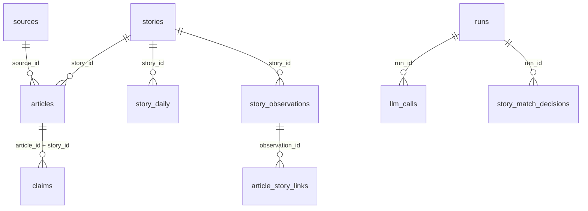

# Database Guide

The project stores local story memory in SQLite at `data/stories.db`.

Use this guide when you want to inspect what the pipeline did, debug a bad story match, read saved claims, or understand why a briefing looked the way it did.

## Open The Database

```bash
sqlite3 data/stories.db
```

Useful SQLite commands:

```text
.tables
.schema runs
.schema stories
.headers on
.mode column
```

For a one-off query from the shell:

```bash
sqlite3 data/stories.db "SELECT run_id, run_date, status FROM runs ORDER BY run_id DESC LIMIT 5;"
```

`--db-off` runs use a temporary database and do not write to `data/stories.db`.

## Mental Model



The most important tables are:

| Table | Meaning |
|---|---|
| `sources` | RSS feed metadata seeded from `src/scraper.py` |
| `stories` | one row per tracked story arc |
| `story_daily` | per-story daily source/importance aggregates |
| `story_observations` | daily memory, including generated summary and delta |
| `articles` | fetched articles linked to a story/date |
| `article_story_links` | article-to-observation links |
| `article_classifications` | cached article theme/story/importance classifications |
| `claims` | validated claims with evidence spans |
| `claim_extractions` | claim extraction cache metadata |
| `runs` | one row per pipeline execution |
| `llm_calls` | one row per real model call |
| `llm_response_cache` | exact response cache for matching, verification, and briefing calls |
| `story_match_decisions` | optional verifier audit rows |

Conditional tables:

- `claims` and `claim_extractions` are created when `--show-evidence` is used.
- `llm_response_cache` is created when exact cached matching, verification, or briefing calls run in an observed pipeline context.
- `story_match_decisions` exists in current tracker schema, but rows are only written when the verifier checks candidate cross-day matches. Verification is on by default and can be disabled with `--no-verify-story-matches`.
- Older databases may lack newer nullable columns until a run touches the relevant schema helper.

## Latest Runs

```sql
SELECT
  run_id,
  run_date,
  status,
  ROUND(COALESCE(total_latency_ms, 0) / 1000.0, 1) AS seconds,
  articles_returned,
  duplicate_url_skips,
  feed_fetch_failures,
  article_text_fetch_successes,
  article_text_fetch_failures,
  claims_saved,
  claim_articles_extracted,
  claim_articles_cached,
  claim_invalid_dropped,
  claim_extraction_failures,
  claim_zero_results,
  stories_touched,
  llm_calls_count,
  llm_cache_hits,
  prompt_tokens,
  completion_tokens
FROM runs
ORDER BY run_id DESC
LIMIT 10;
```

Show failed runs:

```sql
SELECT
  run_id,
  run_date,
  status,
  error_message
FROM runs
WHERE status != 'ok'
ORDER BY run_id DESC;
```

Recreate most of `--pipeline-report` for one run:

```sql
SELECT
  run_id,
  run_date,
  status,
  articles_returned,
  claims_saved,
  claim_articles_extracted,
  claim_articles_cached,
  claim_invalid_dropped,
  claim_extraction_failures,
  claim_zero_results,
  stories_touched,
  duplicate_url_skips,
  feed_fetch_failures,
  article_text_fetch_successes,
  article_text_fetch_failures,
  story_match_verifications,
  story_match_accepts,
  story_match_rejections,
  llm_calls_count,
  llm_errors_count,
  llm_cache_hits,
  schema_failures,
  retry_count,
  prompt_tokens,
  completion_tokens
FROM runs
WHERE run_id = 42;
```

## LLM Calls And Token Use

List calls for the latest run:

```sql
WITH latest AS (
  SELECT MAX(run_id) AS run_id FROM runs
)
SELECT
  call_id,
  purpose,
  model,
  prompt_version,
  latency_ms,
  prompt_tokens,
  completion_tokens,
  schema_failure,
  error_type
FROM llm_calls
WHERE run_id = (SELECT run_id FROM latest)
ORDER BY call_id;
```

Summarize token use by purpose:

```sql
SELECT
  purpose,
  model,
  COUNT(*) AS calls,
  SUM(COALESCE(prompt_tokens, 0)) AS prompt_tokens,
  SUM(COALESCE(completion_tokens, 0)) AS completion_tokens,
  ROUND(AVG(COALESCE(latency_ms, 0)) / 1000.0, 2) AS avg_seconds
FROM llm_calls
GROUP BY purpose, model
ORDER BY calls DESC;
```

Find schema failures:

```sql
SELECT
  run_id,
  call_id,
  purpose,
  model,
  error_message
FROM llm_calls
WHERE schema_failure = 1
ORDER BY call_id DESC;
```

Inspect exact LLM response cache reuse:

```sql
SELECT
  purpose,
  model,
  prompt_version,
  hit_count,
  created_at,
  last_used_at
FROM llm_response_cache
ORDER BY last_used_at DESC, created_at DESC
LIMIT 30;
```

## Stories

Latest story arcs:

```sql
SELECT
  story_id,
  canonical_label,
  theme,
  first_seen,
  last_seen
FROM stories
ORDER BY last_seen DESC, story_id DESC
LIMIT 30;
```

Timeline for one story:

```sql
SELECT
  sd.date,
  sd.source_count,
  ROUND(sd.importance_avg, 2) AS importance_avg,
  so.article_count,
  so.label_seen,
  so.delta_summary
FROM story_daily sd
LEFT JOIN story_observations so
  ON so.story_id = sd.story_id
 AND so.date = sd.date
WHERE sd.story_id = 123
ORDER BY sd.date;
```

Stories touched on a date:

```sql
SELECT
  s.story_id,
  s.canonical_label,
  sd.source_count,
  ROUND(sd.importance_avg, 2) AS importance_avg,
  sd.labels_seen
FROM story_daily sd
JOIN stories s ON s.story_id = sd.story_id
WHERE sd.date = '2026-05-07'
ORDER BY sd.importance_avg DESC;
```

## Articles

Latest articles for a story:

```sql
SELECT
  date,
  source,
  title,
  published_at,
  url
FROM articles
WHERE story_id = 123
ORDER BY date DESC, published_at DESC;
```

Articles for a specific run date:

```sql
SELECT
  story_id,
  source,
  title,
  published_at,
  url
FROM articles
WHERE date = '2026-05-07'
ORDER BY story_id, published_at DESC;
```

Source distribution for a story:

```sql
SELECT
  COALESCE(src.name, a.source) AS source_name,
  src.type,
  src.reliability,
  COUNT(*) AS article_count
FROM articles a
LEFT JOIN sources src ON src.source_id = a.source_id
WHERE a.story_id = 123
GROUP BY COALESCE(src.name, a.source), src.type, src.reliability
ORDER BY article_count DESC;
```

Note: `articles` has no primary key. Treat `id + story_id + date` as the practical context for inspection, especially across reruns.

## Claims And Evidence

Claims for one story:

```sql
SELECT
  c.claim_id,
  c.claim_type,
  ROUND(c.confidence, 2) AS confidence,
  a.source,
  c.claim_text,
  c.evidence_span
FROM claims c
LEFT JOIN articles a
  ON a.id = c.article_id
 AND a.story_id = c.story_id
WHERE c.story_id = 123
ORDER BY c.confidence DESC;
```

Claim extraction cache status:

```sql
SELECT
  article_id,
  story_id,
  prompt_version,
  claims_count,
  extracted_at
FROM claim_extractions
ORDER BY extracted_at DESC
LIMIT 30;
```

Find zero-claim cache rows:

```sql
SELECT
  article_id,
  story_id,
  prompt_version,
  extracted_at
FROM claim_extractions
WHERE claims_count = 0
ORDER BY extracted_at DESC;
```

Important limitation:

- Claims are validated against the input used for extraction.
- Evidence runs use title, RSS description, and fetched full article text when available.
- If full text is empty or unavailable, claim extraction falls back to title plus RSS description.

## Story-Match Verifier Decisions

Latest rejected matches:

```sql
SELECT
  decision_id,
  run_id,
  run_date,
  today_label,
  candidate_label,
  candidate_story_id,
  relationship,
  confidence,
  reject_reason
FROM story_match_decisions
WHERE accepted = 0
ORDER BY decision_id DESC
LIMIT 30;
```

Accepted matches for one run:

```sql
SELECT
  today_label,
  candidate_label,
  candidate_story_id,
  relationship,
  confidence,
  continuity_evidence
FROM story_match_decisions
WHERE run_id = 42
  AND accepted = 1
ORDER BY decision_id;
```

Review adjacent-topic rejections:

```sql
SELECT
  run_date,
  today_label,
  candidate_label,
  confidence,
  reject_reason
FROM story_match_decisions
WHERE relationship = 'adjacent_topic'
ORDER BY decision_id DESC;
```

A good rejected decision is often more valuable than an accepted one. It prevents old memory from absorbing a related but distinct event.

## Classification Cache

Inspect cached classifications:

```sql
SELECT
  article_id,
  theme,
  story_label,
  importance,
  classifier_model,
  prompt_version,
  classified_at
FROM article_classifications
ORDER BY classified_at DESC
LIMIT 30;
```

Find articles reclassified under the current cache row:

```sql
SELECT
  story_label,
  COUNT(*) AS cached_articles
FROM article_classifications
GROUP BY story_label
ORDER BY cached_articles DESC
LIMIT 20;
```

The cache key is effectively:

```text
article_id + classifier_model + prompt_version + title/description content_hash
```

## Source Metadata

List seeded sources:

```sql
SELECT
  source_id,
  name,
  language,
  type,
  reliability,
  bias_notes,
  rss_url
FROM sources
ORDER BY name;
```

Find article rows without `source_id`:

```sql
SELECT
  source,
  COUNT(*) AS article_rows
FROM articles
WHERE source_id IS NULL
GROUP BY source
ORDER BY article_rows DESC;
```

Older rows may not have `source_id`. New rows should get it when the raw source name matches a seeded source.

## Common Debugging Recipes

### Why did a story appear in the briefing?

1. Find the story in `stories`.
2. Check `story_daily` for source count and importance.
3. Check `articles` for the exact source material.
4. Check `story_observations.delta_summary` for the generated memory.
5. If `--show-evidence` was used, check `claims`.

### Why did two events merge?

1. Search `stories.canonical_label`.
2. Inspect `story_daily.labels_seen` across dates.
3. Inspect `articles` for each date.
4. Inspect `story_match_decisions` for the run.
5. If there is no verifier row, the merge came from same-day consolidation, a no-candidate cross-day path, or a run where `--no-verify-story-matches` disabled the verifier.

### Why did LLM calls spike?

1. Check `runs.llm_calls_count` and token totals.
2. Group `llm_calls` by `purpose`.
3. Check `runs.llm_cache_hits`.
4. Confirm whether `--show-evidence`, `--no-verify-story-matches`, or `--fetch-article-text` changed the expected call shape.
5. Check whether classification or claim content hashes changed, invalidating caches.

### Why are there no claims?

1. Confirm the run used `--show-evidence`.
2. Check whether `claims` and `claim_extractions` tables exist.
3. Check `claim_extractions.claims_count`.
4. Remember that invalid model claims are dropped when evidence spans do not appear in the extraction input.

## Do Not Overread The Database

The database is memory and audit state, not a source of truth by itself.

- Evidence-mode `source_agreement` can be backed by saved claim comparison, but ordinary runs still use source identity and briefing-level defaults.
- There is no dedicated `contradictions` table planned for Phase 3; source divergence should be backed by claim comparison instead.
- Publication date is stored; true event date is not separately extracted yet.
- Source support uses `source_id` where available and source-name fallback for older rows, but it still does not prove independent corroboration.
- A stored claim means "the model extracted this from source text and validation passed", not "the real world fact is adjudicated."

For trust decisions, trace back:

```text
Briefing statement -> Claim -> Evidence span -> Article -> Source
```
