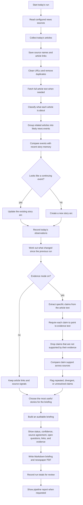
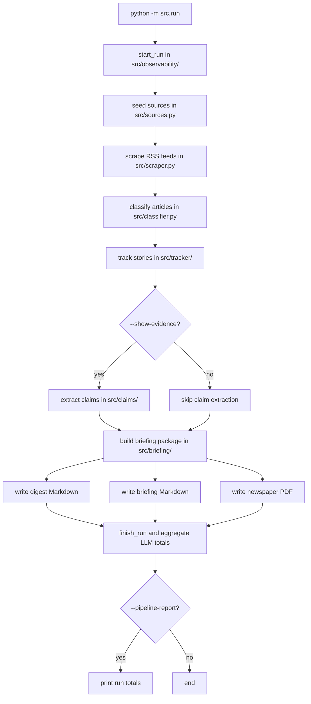
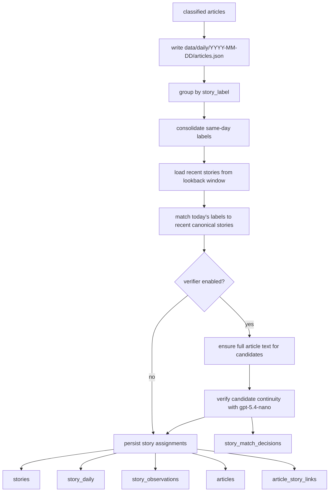
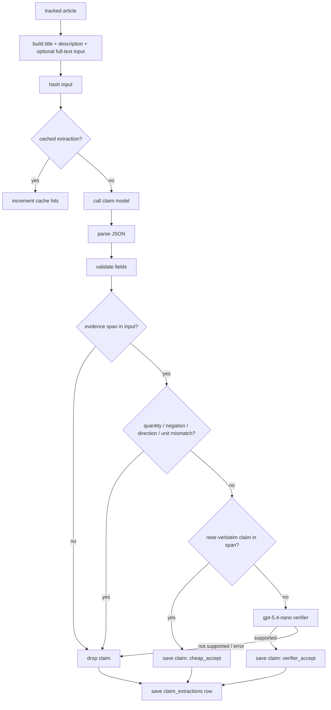
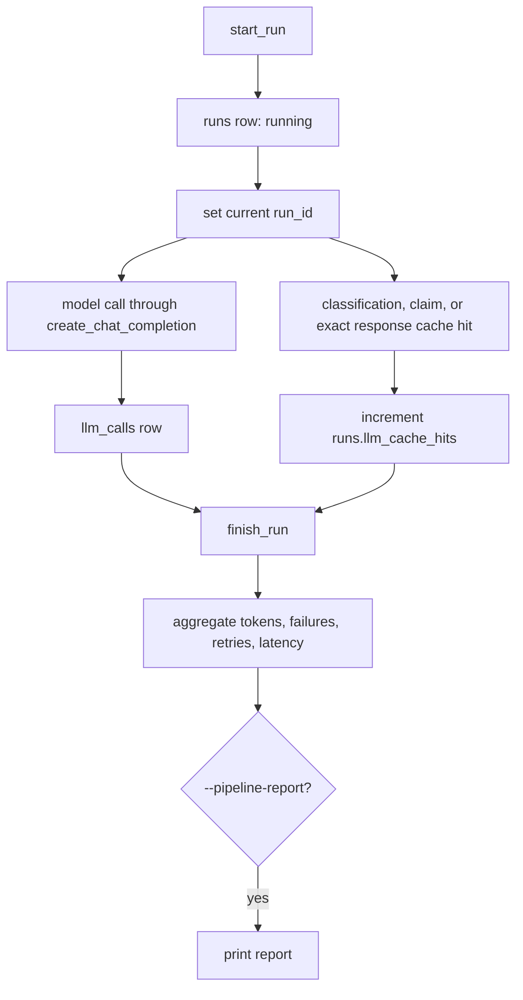

# How The Project Works

This document is a code-path audit of the current pipeline. It explains what happens when you run `python -m src.run`, which files own each stage, which database tables are touched, where LLMs are called, and where the important trust boundaries are.

The project is not a generic article summarizer. It builds local memory of real-world news events.

```text
Source -> Article -> Claim -> Story Arc -> Story Delta -> Briefing
```

## In A Nutshell

One run answers a practical question: what changed in the news today, and what source-backed story memory should be updated?

This view is for non-technical readers. It shows the product behavior before the code-level path.



## One Run At A Glance

`src/run.py` is the entrypoint. `main()` parses CLI flags, starts an observability run, executes the pipeline, writes outputs, finishes the run, and optionally prints `--pipeline-report`.



The main orchestration is intentionally boring:

1. `seed_source_metadata()`
2. `scrape_articles()`
3. `classify_scraped_articles()`
4. `track_stories()`
5. `maybe_extract_claims()`
6. `write_pipeline_outputs()`

That sequence is the spine of the system.

## Stage 1: Sources And RSS Ingestion

Owned by:

- `src/run.py`
- `src/sources.py`
- `src/scraper.py`

Each run first calls `sources.seed_sources()`. This seeds the configured RSS feeds from `src/scraper.py` into the `sources` table. Seeding is idempotent and preserves manually editable metadata such as reliability and bias notes.

Then `scraper.scrape_all()` fetches feed items. For each source it:

- fetches the RSS feed with retry-enabled `requests`
- parses title, link, description, and `pubDate`
- filters by `--date` / `--today` when supplied; `--include-undated` keeps feed items with missing or unparseable timestamps in that date-filtered batch
- normalizes URLs by removing tracking parameters
- deduplicates exact normalized URL repeats
- creates a stable article ID from the normalized URL hash
- optionally fetches full article text with `--fetch-article-text` or `--show-evidence`

The article object passed downstream contains:

```text
id, source, language, title, description, url, published_at, text
```

Important boundary:

- RSS title and description are always available inputs when the feed provides them.
- Full article text is optional and may be empty because extraction can fail, a source can block scraping, or a page may not expose a usable `<article>` or `<main>` body.
- Claim extraction uses full article text when `--show-evidence` is enabled and body extraction succeeds.
- Full article text is also used by the default-on story-match verifier for candidate matches.

## Stage 2: Classification

Owned by:

- `src/classifier.py`
- `src/article_cache.py`
- `src/config.py`
- `src/llm.py`

Classification assigns each article:

```text
theme, story_label, importance
```

The classifier uses `gpt-5.4-mini` by default. It asks for structured JSON and parses with `parse_json_object()`.

Before calling the model, `article_cache.get_cached_classifications()` checks `article_classifications` by:

```text
article_id + classifier_model + prompt_version + content_hash
```

The content hash is built from RSS title and description. If the article content changed, the cache is ignored and the article is reclassified.

Trust boundary:

- The classifier decides grouping labels and importance, not facts.
- It does not produce claims.
- It does not write final briefing prose.
- Cache hits are counted on the current `runs` row, but they are not inserted into `llm_calls`.

## Stage 3: Story Tracking

Owned by:

- `src/tracker/`
- `src/tracker/matching/`
- `src/config.py`

Tracking turns classified articles into local story memory.



The tracker first saves the classified article snapshot under `data/daily/<date>/articles.json`. Then it groups today's articles by `story_label` and asks the tracker model to consolidate same-day label variants. This reduces duplicate arcs such as two labels for the same election result or diplomatic meeting.

Next it loads recent story options from SQLite. The lookback window comes from `DEFAULT_LOOKBACK_DAYS`. Recent options include:

- `story_id`
- canonical label
- last seen date
- previous summary
- previous delta summary
- a few recent article titles

The cross-day matcher decides whether today's labels continue recent canonical stories or should become new stories.

### Default Story-Match Verification

Story-match verification is enabled by default. It adds a second check before a candidate match can reuse old memory. Use `--no-verify-story-matches` only for comparison runs against the older label-only match path.

The verifier receives:

- today's article title and RSS description
- today's article date
- full article text when available
- compact recent story memory
- candidate story label and `story_id`

It returns structured fields:

```text
same_event, relationship, confidence, article_dates,
candidate_last_seen, continuity_evidence, reject_reason
```

Only `same_event`, `same_story_arc`, or `direct_follow_up` decisions with enough confidence and continuity evidence are accepted. `adjacent_topic`, `broader_context`, `uncertain`, malformed, or weak decisions default to a new story.

The verifier exists because broad topical similarity can corrupt memory. A real motivating failure was the 2026-05-07 case where an article about alleged abuse of Palestinian detainees in Israeli detention was attached to the existing `Gaza flotilla raid` story. The correct behavior is to treat that as adjacent Gaza/Israel detention context unless there is concrete continuity evidence tying it to the flotilla event.

Audit trail:

- every verifier decision is stored in `story_match_decisions`
- run totals include accepted and rejected match checks
- exact verifier model responses can be reused for identical prompts through `llm_response_cache`, but stored decision rows are audit records, not a semantic match cache

### Immutable occurrences and replay

Before model-driven grouping, `src/tracker/occurrences.py` stores an append-only snapshot of each captured article plus separate classification and assignment snapshots. Derived article, observation, and hierarchy rows can therefore be rebuilt without changing source evidence.

```bash
python -m src.run --replay 2026-05-07
```

Replay uses stored snapshots only, makes no network calls, rebuilds forward in one transaction, and rolls back if required classification, assignment, or parent context is missing. See ADR 0019.

## Stage 4: Claims And Evidence

Owned by:

- `src/claims/`
- `src/briefing/grounding.py`

Claims are optional and enabled with:

```bash
python -m src.run --show-evidence
```

For each tracked article, `claims.extract_and_save_claims()` builds the extraction input from title, RSS description, and fetched full article text when available:

```text
title

description

full article text
```

It then checks `claim_extractions` by:

```text
occurrence + content hash + model + prompt version + validation-policy version
```

If the cache is valid, the model call is skipped and the current story ID is updated if tracking changed. Zero-claim outputs are cached too.

If the article is not cached, the claim extractor asks the model for:

```text
claim_text, claim_type, entities, evidence_span, confidence
```

Allowed claim types are:

```text
fact, number, quote, prediction, allegation, background
```

Validation is strict. A claim is dropped unless:

- `claim_text` is non-empty
- `claim_type` is allowed
- `entities` is a list of non-empty strings
- `confidence` is numeric and in `[0.0, 1.0]`
- `evidence_span` is non-empty
- `evidence_span` appears in the extraction input
- `claim_text` is *derivable* from `evidence_span` under the conservative gate below

### Derivability Gate

Span containment is necessary but not sufficient: a model could pair any article sentence with any claim and pass substring validation. The derivability gate in `_derivability_check()` and `_classify_claim()` decides whether the span actually supports the claim. See [docs/adr/0013-claim-evidence-derivability.md](adr/0013-claim-evidence-derivability.md).

1. **Deterministic reject** — drop missing quantities, preserving decimal commas as decimals, and explicit negation, direction, or common-unit conflicts. No LLM call.
2. **Deterministic accept** — accept only when normalized `claim_text` is contained in `evidence_span` ("cheap_accept").
3. **LLM verifier** — route every other paraphrase, including entity overlap and anaphoric spans, through the cached `gpt-5.4-nano` verifier. Network, parse, malformed-schema, and uncertain results reject.

The verifier runs **outside** the SQLite transaction so its network call does not hold a write lock. Run totals expose `claim_derivable_accepts`, `claim_verifier_calls`, `claim_verifier_accepts`, and `claim_verifier_rejects`.



Important boundary:

- Claim extraction is extraction, not interpretation.
- Evidence-mode source agreement uses current-day claims for exact/similar support and precise number/date/status/attribution divergence. Six prior days are dated context only.
- The claims table does not prove truth, source independence, or confirmed contradiction.
- Full text can be empty when scraping fails; in that case the claim extractor falls back to title and RSS description.

## Stage 5: Briefing Package And Outputs

Owned by:

- `src/briefing/selection.py`
- `src/briefing/generation.py`
- `src/briefing/grounding.py`
- `src/briefing/service.py`
- `src/briefing/markdown.py`
- `src/digest.py`
- `src/rendering/newspaper.py`

`run_pipeline()` writes three possible artifacts:

- digest Markdown in `output/`
- briefing Markdown in `briefings/`
- newspaper PDF in `newspapers/`

The important detail is that `src/briefing/service.py` builds one briefing package and reuses it for Markdown and PDF output. This prevents the PDF from becoming a separate intelligence pipeline.

Story selection works like this:

- aggregate tracked articles by canonical story
- compute source count, average importance, themes, trend, previous context, and observation IDs
- score by importance, source count, and movement
- select lead stories plus politics/economy/other sections
- exclude low-value categories from lead placement when appropriate

Briefing generation uses bounded batches of up to eight displayed stories, with at most six recent articles per story. The model returns structured story-card fields:

```text
status, confidence, source_agreement, dispute_flag,
delta_summary, briefing, open_questions
```

The allowed labels are normalized and defaults are supplied when the model omits or malforms a field. If a displayed story comes back without briefing text, the system retries missing stories and then falls back to deterministic text if needed.

When evidence mode is enabled, saved claims are summarized before the briefing call:

- exact repeated non-background claims across distinct source identities can move agreement to `partial` or `broad`
- conservative similar-claim groups can provide `partial` multi-source support, without implying independence
- precise number, date, status, and attribution differences create lightweight source-divergence notes and force `mixed`
- only current-day claims affect current agreement; six prior days are visibly dated context
- claim-backed labels override the model's briefing-level `source_agreement`; divergence forces `possible conflict`
- this adds no new LLM call and no new database table

After briefing generation, `save_observation_memory()` writes the generated summary and `delta_summary` back to `story_observations`. That is what lets the next run compare today's reporting against previous context.

Trust boundary:

- The briefing is the final prose layer.
- It may synthesize across articles and claims, but it should not invent unsupported facts.
- Without evidence mode, `source_agreement` and `dispute_flag` remain briefing-level signals backed by source identity and prompt constraints.
- With evidence mode, the deterministic claim-backed summary can override these labels when comparable saved claims exist.

## Stage 6: Observability

Owned by:

- `src/observability/`
- `src/llm.py`
- model-calling modules

`main()` starts a run before the pipeline begins:

```text
runs.status = running
```

Every real LLM call records one `llm_calls` row when a current run ID exists. Cache hits update total and layer-specific counters on `runs` instead of inserting fake call rows. Interrupted `running` rows become `abandoned` at the next startup.

At the end, `finish_run()` aggregates LLM rows into the run:

- call count
- error count
- schema failures
- application retries (`SDK retries` are reported as unavailable because the client does not expose them)
- prompt tokens
- completion tokens
- total latency
- estimated cost from explicit model pricing

Scraper and claim-extraction counters are written to the run as the pipeline executes. Exact responses older than 30 days are ignored, and successful runs prune the table to at most 1,000 rows.



Current report shape:

```text
Run #42 (2026-05-07, ok, 74.2s)
Articles returned:      231
Duplicate URLs skipped: 12
Feed fetch failures:    1
Outside date skipped:   44
Undated included:      0 (0 missing, 0 unparseable)
Undated skipped:       5 (4 missing, 1 unparseable)
Article text fetched:   90
Article text failures:  18
Claims saved:           612
Claims extracted:       112
Claims cached:          35
Claims invalid:         24
Claim failures:         2
Zero-claim results:     19
Claim cheap accepts:    584
Claim verifier calls:   42
Claim verifier accepts: 28
Claim verifier rejects: 14
Claim input truncation:  3
Stories touched:        38
Story match checks:     14
Story match accepted:   10
Story match rejected:   4
LLM calls:              28
LLM errors:             0
LLM cache hits:         9
  classification:       3
  claims:               2
  verifier:             1
  matching:             2
  briefing:             1
  other:                0
Schema failures:        0
Application retries:    0
SDK retries:            not exposed by client
Tokens:                 prompt 18420 / completion 3910
Estimated cost:         EUR 0.21
  claim: 7 calls, tokens 7200/1300, latency 9.4s, EUR 0.01
Novelty audit:
New parent ratio:      2/8 (25.0%)
High-signal not displayed: 1
High-signal new parent arcs: 2
New parent arcs with prior candidates: 1
Rejected related matches: 3
```

Cost estimates use explicitly maintained model pricing in `src/config.py` and the token totals stored in `llm_calls`. The novelty audit is review telemetry only: it surfaces suspicious selection and parent/child cases without changing story memory or briefing output.

## What Costs Money

Potentially expensive paths:

- article classification for uncached articles
- same-day consolidation
- cross-day story matching
- default-on story-match verification
- optional claim extraction
- briefing generation

Cost controls today:

- classification cache
- claim extraction cache
- zero-claim cache
- exact LLM response cache for matching, verification, and briefing prompts
- batched briefing generation
- `--max-per-source` for smaller runs
- `--db-off` for isolated experiments
- `--pipeline-report` for scraper counts, claim metrics, token, latency, cost, and novelty-audit inspection

The most expensive failure mode is not just token spend. A false story merge can corrupt memory across future runs, which is why conservative matching and verifier audit rows matter.

## Current Weak Points

The current system is useful, but several important trust layers are incomplete:

- Source metadata is stored and deterministic source support uses `source_id` with a source-name fallback.
- Evidence-mode source agreement covers exact/similar support and precise number/date/status/attribution divergence, but not independent corroboration.
- There is no dedicated contradiction module/table. Structured divergence is surfaced as `possible conflict`, not confirmed contradiction.
- Evidence runs use full article text for claim extraction when body text is available.
- The derivability gate is in place, but the verifier's paraphrase decisions are asserted by tests with mocks, not measured against reviewed paraphrase cases in `evals/datasets/golden_claims.jsonl`. There is also no per-claim audit row recording which path (cheap accept, verifier accept, verifier reject) decided a saved claim.
- Exact LLM responses for matching, briefing, and the claim verifier can be cached, but there is no semantic story-match decision cache.
- Article deduplication is URL-based, not content-fingerprint-based.

These are the right next improvements because they make the system more inspectable, grounded, and hard to fool.
